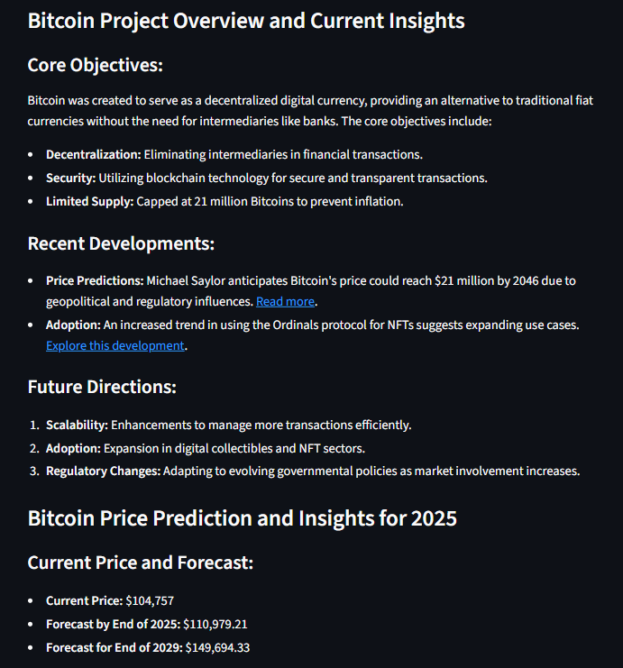

# 💹 Crypto Insights with Multi-Agent System

A smart crypto analytics app powered by **Phi Agents**, **OpenAI**, and **Streamlit** that answers crypto-related questions using real-time data, market fundamentals, and live web searches. This multi-agent system can analyze project descriptions, forecast 2025 trends, and tell you whether it's worth investing — all in one click.

---

## 🚀 Features

- 🧠 Uses a **multi-agent system** to fetch insights from both web and financial sources
- 📊 Presents **fundamentals** and **analyst recommendations** using tables
- 🔎 Real-time **live crypto prices** from web searches (2025 outlook)
- 📢 Includes **Buy or Not** recommendations with reasons
- 🧾 Answers are structured in **Markdown**, often with sources

---

## 🛠️ Tech Stack

- **Frontend/UI**: [Streamlit](https://streamlit.io/)
- **Agents Framework**: [Phi](https://docs.phidata.io/)
- **AI Models**: OpenAI (via `openai` Python SDK)
- **Data Tools**:
  - `phi.tools.yfinance` for crypto fundamentals and analyst recommendations
  - `phi.tools.duckduckgo` for live web data

---

## 📦 Installation

### 1. Clone the repository

```bash
git clone <repository-url>
cd <repository-folder>
```

### 2. Install dependencies

```bash
pip install -r requirements.txt
```

### 3. Set up environment variables

Create a `.env` file in the root directory and add your OpenAI API key:

```env
OPENAI_API_KEY=your_openai_api_key_here
```

### 4. Run the app

```bash
streamlit run app.py
```

---

## ✨ How It Works

1. User enters a crypto-related query like:  
   `"Bitcoin Price Prediction"` or `"Should I invest in Ethereum?"`

2. **Two AI agents** are activated:
   - 📊 **YFinance Agent**: Analyzes project fundamentals
   - 🌐 **Web Search Agent**: Searches web for real-time price & sentiment

3. **Multi-Agent Coordinator** merges responses, analyzes and recommends

4. Output includes:
   - Project background
   - Price outlook
   - Fundamental analysis
   - Recommendation (Buy/Hold/Sell)
   - Sources of information

---

## 🔍 Example Use Cases

- ✅ "Bitcoin price prediction for 2025"
- ✅ "Is Solana a good investment now?"
- ✅ "Dogecoin fundamentals and analyst recommendations"
- ✅ "Latest updates on Polygon project"

---

## 🔒 Requirements

- Python 3.8+
- OpenAI API key
- Internet connection for real-time DuckDuckGo search

---

## 🧠 Sample Screenshot



---

## ❗ Troubleshooting

- If no response appears, ensure:
  - You have an active OpenAI API key
  - DuckDuckGo search doesn’t fail due to rate limits
  - You are using a valid crypto keyword

---

## 📄 License

MIT License

---

## 🙌 Acknowledgements

- [Phi SDK](https://docs.phidata.io/)
- [OpenAI](https://openai.com/)
- [Streamlit](https://streamlit.io/)
- [Yahoo Finance](https://finance.yahoo.com/)
- [DuckDuckGo](https://duckduckgo.com/)